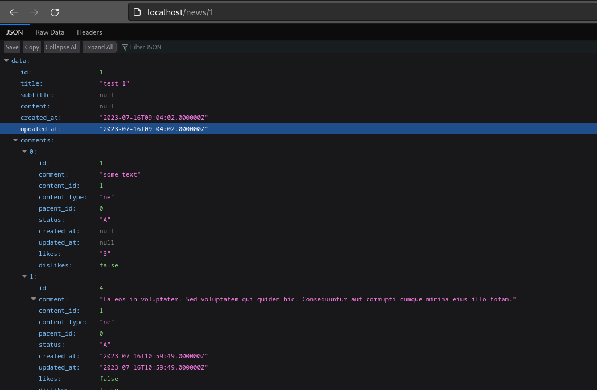

## setup project

1. run following command in root of project [news-sample]
    1. systemctl start docker
    2. ./vendor/bin/sail up -d
    3. ./vendor/bin/sail root-shell
    4. sudo chmod -R 777 storage
    5. sudo chmod -R 777 bootstrap
    6. php artisan cache:clear
    7. php artisan db:seed --class=NewsSeeder
    8. php artisan db:seed --class=CommentSeeder
2. all request base url is http://localhost
3. all routes exist in web.php

# sample output

